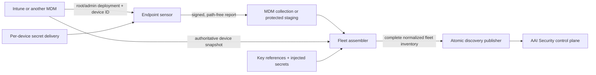

# Endpoint installation and process evidence publisher

## Purpose

Intune establishes the managed-device population, but device enrollment and
software inventory do not prove that Claude Code or Codex is running for a
particular governed project. This design adds a separate endpoint evidence
path. An administrator-run sensor measures configured installations on each
device, signs a content-minimised report with a per-device credential, and a
fleet job joins current reports to the authoritative MDM device export before
using the existing atomic discovery publisher.

This is an observational control. It can lower coverage assurance and create a
finding; it cannot enroll an agent, grant policy authority, approve an action,
or execute a model-requested command.

## Architecture and trust boundaries



The sensor configuration, filesystem, process table, device identifier,
project paths, report transport and key identifier are untrusted. Endpoint
management must run the sensor as root or an administrator, protect its exact
configuration, inject the device secret outside command arguments, and deliver
reports through an authenticated management channel. The sensor never accepts
credentials, identity, policy state or approval state from model output.

Each sensor report is HMAC-SHA-256 signed over canonical JSON with a secret
unique to the device. The fleet key map binds a key identifier to exactly one
device and names the environment variable containing its secret. Secrets are
never stored in the map, report, command line, normalized inventory, logs or
control-plane payload. HMAC proves possession of a software credential; it is
not hardware attestation. A production rollout should prefer MDM-managed secret
delivery and rotate or revoke a key when device custody changes.

## Sensor contract

`scripts/collect_endpoint_evidence.py` reads a root-owned schema-1 manifest. It
contains one managed device and one or more expected installations. Each
installation names:

- a stable installation ID and supported host (`claude-code` or `codex-cli`);
- an absolute project root whose UTF-8 path is reduced to SHA-256 before output;
- an absolute binary path and optional expected binary SHA-256;
- one or more absolute process executable paths; and
- optional opaque user, repository and business-unit correlation identifiers.

The collector rejects unknown fields, duplicate identifiers, relative paths,
symlinked binaries, non-regular binaries, oversized files, invalid digests,
unsupported hosts, non-administrator execution and unavailable process
inspection. A real POSIX run additionally requires the manifest to be a
root-owned regular file with no group/world write bit. It uses the optional
`endpoint` dependency (`psutil`) to inspect exact executable and working-
directory pairs without invoking a shell. `processActive` is true only when
both the executable and configured project root match. Access-denied or
incomplete process enumeration fails the entire report rather than recording
an unsafe false negative.

Install the process adapter on sensor devices with
`pip install 'agentic-security-sdk[endpoint]'`. The fleet job may use the core
package because it verifies reports but does not inspect a local process table.

Windows manifest ACL verification remains fail-closed until a dedicated ACL
adapter can prove owner SID and write access. The current production reference
sensor is therefore macOS/Linux; Intune may still deploy it to managed macOS
devices and supply the device denominator for mixed fleets.

Output contains only the canonical payload, key identifier and signature. Raw
paths, process arguments, environment, usernames, prompts, commands and tool
content are never emitted. `binaryPresent` is true only for a regular,
executable, non-symlink file that matches the configured digest when one is
present. `processActive` is true only when an inspected process has exact
resolved executable-path and project-working-directory matches.

## Fleet assembly and atomic publication

`scripts/assemble_endpoint_inventory.py` consumes:

1. a current normalized Intune/MDM inventory containing only `device`
   observations;
2. a directory of signed endpoint reports; and
3. a schema-1 key map whose entries bind `keyId`, `deviceId` and `secretEnv`.

Every report must have an exact schema, a known non-revoked key, a matching
device identity, a valid signature and a bounded age. Duplicate device reports,
duplicate installation identities, reports for devices outside the
authoritative inventory, missing secrets and malformed content fail the whole
assembly. The job emits every authoritative device plus installations from all
current authenticated reports. It does not silently drop a bad report and does
not claim that a device record is installation evidence.

The resulting file is passed to `publish_discovery_generation.py`, which
commits all pages under one expected revision. Independent devices never write
the endpoint source directly, avoiding last-writer-wins loss of the fleet.

## Deployment journey

1. Create a dedicated endpoint discovery source and store its one-time
   publisher credential in the fleet job's secret manager.
2. Export the current Intune device inventory with the managed Intune collector
   or the standalone fixed-query adapter:

   ```bash
   AZURE_GRAPH_TOKEN='<from-secret-manager>' \
     python scripts/collect_discovery_inventory.py intune \
     --mapping /secure-input/intune-business-units.json \
     > /secure-input/intune-devices.json
   ```

   The application credential needs only
   `DeviceManagementManagedDevices.Read.All`; omit `--mapping` when business-
   unit attribution is not required.
3. Generate a unique random sensor secret per device. Deliver the manifest,
   key identifier and secret with root/admin MDM controls. Do not use one fleet
   shared secret.
4. Run the sensor on a schedule shorter than the configured report maximum age
   and collect its stdout as a protected artifact.
5. Run the fleet assembler in an isolated job with key secrets injected as the
   environment names declared by the key map.
6. Review the path-free normalized inventory, publish one atomic generation,
   and verify source freshness and Coverage posture separately.
7. Rotate or revoke a device key on reassignment, loss or offboarding. Remove
   stale reports under the enterprise retention policy.

## Platform and Microsoft constraints

Microsoft Intune Discovered Apps and its v1.0 Graph `detectedApps` relationship
can corroborate an installed application, but refresh timing varies and the
record does not establish an active process or governed project root. Windows
App inventory provides richer and faster installation metadata but still does
not supply the required runtime/project evidence. Intune Remediations can run a
detection script and export bounded output, but its Graph device-run-state API
is beta. The reference publisher therefore keeps endpoint evidence
provider-neutral and does not make beta Graph behavior a trust dependency.

Official references:

- [Intune discovered apps](https://learn.microsoft.com/en-us/intune/app-management/discovered-apps)
- [Microsoft Graph detectedApp v1.0](https://learn.microsoft.com/en-us/graph/api/resources/intune-devices-detectedapp?view=graph-rest-1.0)
- [Windows app inventory](https://learn.microsoft.com/en-us/intune/app-management/deployment/enhanced-app-inventory)
- [Intune Remediations](https://learn.microsoft.com/en-us/intune/device-management/tools/deploy-remediations)
- [deviceHealthScriptDeviceState beta API](https://learn.microsoft.com/en-us/graph/api/resources/intune-devices-devicehealthscriptdevicestate?view=graph-rest-beta)

## Security acceptance criteria

- A sensor cannot run without administrator identity, a known device key and a
  complete process view.
- Unknown manifest/report/key-map fields, duplicate identities and unsafe paths
  fail closed.
- Binary evidence rejects symlinks, non-regular files, non-executable files and
  configured digest mismatches.
- Process evidence binds exact executable and working-directory paths and never
  invokes a shell.
- A changed payload, wrong key, cross-device report, revoked key, stale report,
  unknown device or duplicate report makes fleet assembly fail.
- No raw path, secret, process argument, prompt, command or tool content reaches
  normalized inventory or control-plane telemetry.
- The fleet assembler emits one complete snapshot input; only the existing
  atomic generation commit can make it current.

## Remaining production acceptance

The implementation provides a deployable reference sensor and fleet assembly
contract, not hardware-backed attestation or an MDM product package. Enterprise
acceptance still requires root/admin rollout through the customer's Intune or
Jamf tenant, independent verification of file ownership and secret delivery,
successful reports from at least 95% of the agreed pilot, explicit review of
the remaining devices, and UI health visibility for sensor/report freshness.

The optional [hosted endpoint evidence channel](hosted-endpoint-evidence.md)
now provides central credential lifecycle, signed ingestion and server-derived
per-device freshness. It removes the UI visibility gap, but not the real MDM,
Windows ACL, hardware-backed identity or 95% pilot acceptance above.
