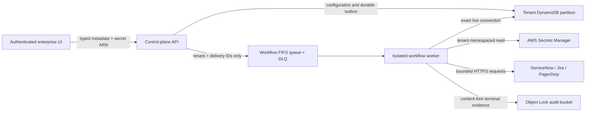

# Governed incident workflow integrations

This design implements the production-shaped foundation of P1-SOC-09 for
ServiceNow, Jira and PagerDuty. It sends content-minimised incident-case
lifecycle events through provider-specific adapters. It does not let an
external ticket, webhook response or provider credential change SDK authority,
approve an action, select an agent or close an AAI Security case.

## Customer outcome

A platform administrator can register a provider connection, verify it before
activation, subscribe it to bounded case events and monitor every delivery.
When an AAI Security case is opened, contained, resolved or closed, the control
plane creates or reconciles one external incident using a deterministic case
identity. Operators can pause or retire delivery without changing the retained
case or its response controls.

The first providers are:

- **ServiceNow:** OAuth client credentials and the Incident Table API;
- **Jira Cloud:** a scoped service-account email/API token and the issue API;
- **PagerDuty:** an Events API v2 routing key and `dedup_key` lifecycle.

Provider credentials are supplied as an administrator-created AWS Secrets
Manager secret under the tenant namespace
`aai-sec/workflows/<tenant>/<connection>`. The browser and API Lambda receive
only its ARN. The dedicated worker is the sole runtime principal allowed to
read that namespace.

## Trust boundaries



The browser cannot submit secret bytes, arbitrary request bodies, headers,
provider paths or tenant identity. The API validates a closed provider schema,
public HTTPS origin and tenant-owned secret ARN, but never reads credential
material. Queue messages contain no endpoint, credential, case payload or
external reference. The worker reloads live connection and delivery authority
before every attempt.

External systems are untrusted workflow peers. A successful response proves
only that the configured provider accepted the bounded request. External issue
state never becomes policy, identity, approval, containment, recovery or case-
transition authority in AAI Security.

## Closed configuration

Every connection has a generated stable ID, name, optional description,
provider, provider configuration, secret ARN, subscribed events, status and
optimistic revision.

Provider configuration is exact:

- ServiceNow: public `https://<instance>.service-now.com` origin and optional
  bounded assignment-group identifier;
- Jira: public `https://<site>.atlassian.net` origin, uppercase project key and
  bounded issue type;
- PagerDuty: no caller-selected origin and a bounded service label.

Supported events are `case.opened`, `case.contained`, `case.resolved` and
`case.closed`. Unknown fields, duplicate events, credential-bearing URLs,
private/local origins, query strings, fragments and custom ports fail closed.

Secrets use exact schema-v1 JSON:

```json
{"schemaVersion":1,"clientId":"synthetic-client","clientSecret":"synthetic-secret"}
```

for ServiceNow,

```json
{"schemaVersion":1,"email":"workflow@example.test","apiToken":"synthetic-token"}
```

for Jira, and

```json
{"schemaVersion":1,"routingKey":"synthetic-routing-key"}
```

for PagerDuty. Secret values are bounded and never returned, logged or copied
into delivery records.

## Lifecycle and operator journey

1. The administrator creates the provider credential in the documented tenant
   Secrets Manager namespace.
2. In **Administration → Incident workflows**, they select a provider and
   enter only typed non-secret configuration plus the secret ARN.
3. The new connection is `pending_verification` and cannot receive real cases.
4. **Verify connection** creates one server-owned synthetic incident. A worker-
   derived success binds the exact connection revision and credential ARN.
5. **Activate** succeeds only while that matching verification remains current.
6. Case lifecycle changes create deterministic outbox records for subscribed,
   active connections.
7. Operators inspect provider reference, attempt count and coarse
   failure code. They may retry a terminal failure explicitly, pause/resume or
   retire the connection with a retained rationale.

Resume requires a fresh verification after any configuration revision. Retire
is irreversible in the product record and does not delete the administrator-
owned secret.

## Idempotency and provider reconciliation

One delivery identity binds tenant, connection, case, case revision and event
type. The FIFO queue serializes one connection, while DynamoDB remains the
outbox authority if SQS submission fails.

- PagerDuty uses the AAI case ID as `dedup_key` and maps open/contained to
  `trigger`, resolved/closed to `resolve`.
- ServiceNow searches the exact AAI `correlation_id` before creating an
  incident and retains the returned `sys_id`/number.
- Jira searches one deterministic AAI case label before creating an issue and
  retains the returned issue key.

Those lookups repair the ambiguous “provider committed but HTTP response was
lost” edge. More than one matching external object is an integrity failure,
not a reason to choose one. Delivery is at least once. Queue retries retain the
same identity; an operator-controlled retry creates a new linked identity only
for an unchanged active connection and again reconciles the provider case.
Local terminal evidence is immutable.

## Creating the credential secret

Create provider credentials outside the browser and source tree. First obtain
the deployed `WorkflowCredentialKeyArn` output. Put values in a temporary JSON
file with owner-only permissions, using the matching schema shown above:

```bash
aws secretsmanager create-secret \
  --name 'aai-sec/workflows/<tenant-id>/<connection-name>' \
  --kms-key-id '<WorkflowCredentialKeyArn>' \
  --secret-string 'file:///absolute/private/path/workflow-credential.json'
```

Copy only the returned ARN into **Incident workflows**. Delete the temporary
file securely according to enterprise procedure. To rotate, first pause the
connection, update Secrets Manager with `put-secret-value`, verify the current
paused revision and resume it. Never paste credential JSON into the UI, documentation, tickets,
chat, shell history or source control.

## Data boundary

Outbound payloads contain only schema version, deterministic event/case IDs,
case status, severity, fixed alert source/reason code, bounded server-generated
title, host type, enrolled agent ID when bound, and occurrence time. They do
not contain prompts, tool arguments/results, commands, project paths,
credentials, approval rationale, operator rationale or raw evidence.

Provider response bodies are read only to recover a bounded external ID and
are never persisted. Delivery evidence records status, attempt count, HTTP
status, coarse failure code, timestamps and the external reference.

## Failure semantics and limits

- Requests use TLS, no redirects, public DNS revalidation, five-second HTTP
  timeouts and a 16 KiB response bound.
- Five failed receives move the identity to a 14-day DLQ and raise an alarm.
- Connections are limited to 20 per tenant; delivery history is limited to 100
  per connection and retained for 30 days.
- Missing/malformed credentials, changed revision, paused/retired connection,
  ambiguous reconciliation, unsafe DNS, timeout and unexpected response fail
  delivery without changing the case.
- Deployment-owned egress controls remain required against DNS rebinding and
  to restrict destinations to approved SaaS origins.

## Non-guarantees and live acceptance

This foundation does not prove a customer's ServiceNow fields, Jira workflow,
PagerDuty escalation policy, proxy, egress controls or credential scope. It
does not synchronize external comments or status back into AAI Security. Live
enterprise acceptance still requires customer-owned non-production tenants,
least-privilege credentials, interruption/retry/DLQ exercises, duplicate-loss
tests and retained provider evidence.

Splunk remains a separate explicitly non-delivering SIEM stub.

## Required evidence

Tests must cover exact schemas, tenant secret namespace, role and tenant
isolation, no secret reads in the API, pending-verification gating, stale
revision denial, deterministic event identity, each provider request/response,
ambiguous reconciliation, timeout/redirect/private-network denial, outbox
repair, retries/DLQ, content minimisation, terminal audit and responsive UI.
The full SDK and UI gates must pass before deployment.
