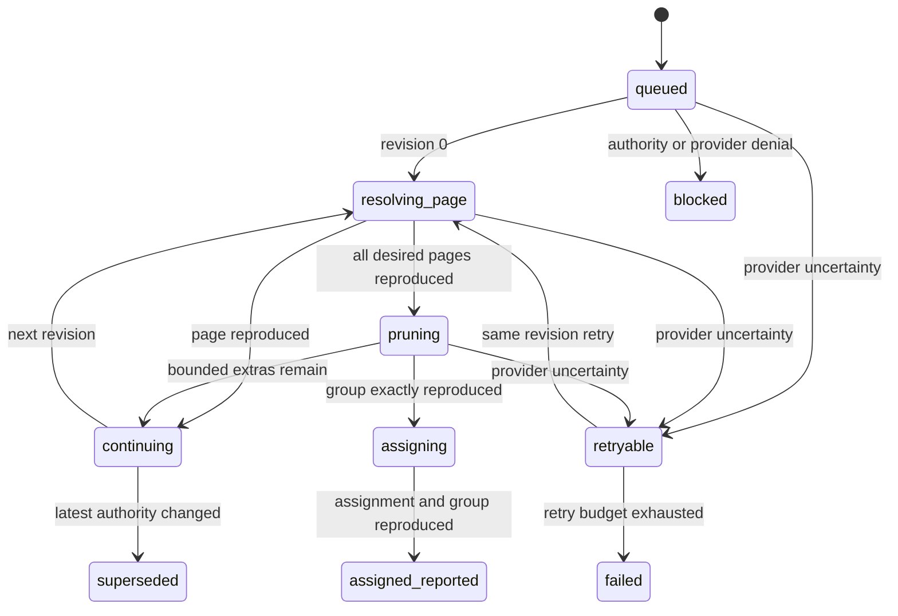

# Microsoft Intune bounded continuation authority

## Decision

Large endpoint cohorts are reconciled through resumable, revision-bound FIFO
continuations. A continuation is not a new authorization and cannot widen the
sealed command. Every invocation reloads the latest command pointer, active
provider version, rollout, package authority, agent lifecycle, managed-device
inventory and signed endpoint evidence before it reads credentials or contacts
Microsoft Graph.

The existing single-invocation path remains for cohorts of at most 40 targets.
Larger commands use the same immutable pages, processing one page of at most 40
targets per continuation. Provider assignment is created only after every
desired device is independently reproduced in the dedicated AAI-owned group
and every non-desired member has been removed.

## Trust boundaries

- The API creates one immutable command and its complete cohort; it cannot
  select a continuation page after dispatch.
- The worker receives only tenant ID, command ID and expected continuation
  revision. It derives the stage and page from server-owned state.
- Provider credentials remain available only to the isolated worker.
- Raw Graph object IDs remain in worker memory. Continuation state persists
  only page number, revision, bounded mutation count and fixed reason codes.
- The operator projection exposes progress counts and hashed final provider
  evidence, never Graph IDs, URLs, provider payloads or credentials.
- `assigned_reported` remains provider-channel evidence. Only fresh exact
  runtime attestation can establish installation or execution.

## State machine

The message revision must equal the strongly consistent command revision. A
stale duplicate can only repair delivery of the current revision; it cannot
repeat an earlier page or advance state. State is persisted before the next
message is sent. If sending fails, redelivery of the previous FIFO message
observes the newer revision and idempotently repairs the missing continuation.

## Provider convergence

For each page the worker:

1. reloads and validates the complete command authority;
2. validates the reviewed group and app metadata;
3. lists current group members with directory device-registration identity;
4. resolves each page registration through the fixed Graph device endpoint;
5. rejects duplicate, disabled or changed identities;
6. adds only missing exact members, with online authority checks; and
7. reproduces the page before advancing its continuation revision.

After the last page, the worker compares the complete desired registration set
with the dedicated group. It removes at most 40 non-desired members per
invocation. Only an exact reproduced group permits the one required app
assignment. Existing unrelated app assignments are preserved.

## Bounds and failure behavior

- at most 500 targets, matching the control-plane command and agent inventory
  bound;
- at most 20 immutable pages and 40 provider mutations per invocation;
- monotonically increasing continuation revision, capped at 64;
- one FIFO record per invocation and tenant-ordered message group;
- five transport/provider retries for one exact continuation revision;
- reserved worker concurrency, 60-second timeout, six-minute queue visibility,
  encrypted FIFO/DLQ and explicit self-send permission; and
- no redirect, arbitrary Graph origin, free-form request body or browser
  continuation control.

Authority drift marks the old command `superseded` or `blocked`; it never
continues from stale progress. Provider timeout and throttling retain the exact
revision for retry. A partially changed dedicated group is not success and is
converged only by the latest still-authorized command.

## Required evidence

Automated contracts must prove:

- a 41-target command no longer reads credentials and then fails on size;
- exact page progression and stale-message repair;
- no assignment before complete group reproduction;
- idempotent replay after partial add or send failure;
- supersession and agent/evidence/provider drift denial between pages;
- bounded removal of stale members without touching unrelated app assignments;
- no raw Graph identifiers in API, audit, failure or UI projections; and
- final `assigned_reported` remains separate from runtime verification.

Live acceptance still requires a customer-owned non-production Intune tenant,
approved packages and managed Claude Code and Codex devices.
