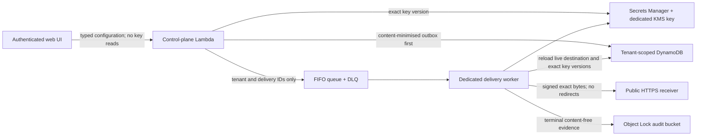

# Secure webhooks

Secure webhooks provide a tenant-scoped, signed automation boundary for
redacted AAI Security events. They satisfy the implementation foundation of
P1-ADM-10. They do **not** by themselves satisfy P0-07: a customer SIEM still
needs a supported event schema, searchable ingestion, operational monitoring
and live interruption/replay acceptance.

## Operator journey

1. A platform administrator opens **Administration → Webhooks** and registers
   a credential-free public HTTPS receiver.
2. The control plane creates a 256-bit HMAC secret in AWS Secrets Manager and
   displays the secret to the administrator exactly once.
3. The receiver stores the secret in its own approved secret manager and uses
   `verify_webhook` against the exact raw request body.
4. The administrator sends a server-owned verification event and confirms the
   delivery evidence in the destination detail view.
5. During rotation, the worker sends signatures from both the new and previous
   keys for the selected one-hour to seven-day overlap. The receiver accepts
   both key IDs until the displayed deadline and then removes the old key.
6. Operators can pause, resume or retire a destination using revision-bound
   changes and a retained rationale.

## Trust boundaries and data flow



The browser never receives a secret after creation or rotation. Queue messages
contain only tenant and delivery identifiers, so they cannot replace the
endpoint, payload or key authority. The worker reloads all authority for every
attempt. It runs separately from the API Lambda and has only the table, audit,
queue and webhook-secret permissions needed for delivery.

## Signing and receiver contract

Version 1 signs these exact bytes:

```text
<unix timestamp>.<delivery ID>.<raw HTTP request body>
```

with HMAC-SHA256. The primary headers are:

| Header | Meaning |
| --- | --- |
| `AAI-Webhook-Version` | Signing contract version, currently `1`. |
| `AAI-Webhook-Id` | Stable delivery identity used for atomic replay claims. |
| `AAI-Webhook-Timestamp` | Unix timestamp covered by the signature. |
| `AAI-Webhook-Key-Id` | Current non-secret key identifier. |
| `AAI-Webhook-Signature` | `v1=<lowercase SHA-256 hex>`. |

During rotation, `AAI-Webhook-Previous-Key-Id` and
`AAI-Webhook-Previous-Signature` are also present. Receivers should select a
key by ID, compare the HMAC in constant time, enforce a short timestamp
tolerance and atomically claim the delivery ID before processing. The replay
store must be shared and durable for a horizontally scaled receiver. A replay
store outage fails closed.

```python
from agentic_security import WebhookVerificationStatus, verify_webhook

verification = verify_webhook(
    raw_request_body,
    request_headers,
    keys={"key-current": secret_from_your_secret_manager},
    replay_store=durable_atomic_replay_store,
)
if verification.status is not WebhookVerificationStatus.VERIFIED:
    reject_request()
process_once(raw_request_body)
```

Do not parse and re-serialize the body before verification. Do not use an
in-process set as the production replay store.

## Delivery and failure semantics

- The outbox record is persisted before its identity is submitted to a FIFO
  queue. A one-minute dispatcher retries records not accepted by SQS.
- Delivery is at least once. The stable delivery ID and receiver replay claim
  provide idempotent processing.
- Each HTTP attempt has a five-second timeout. Redirects are rejected and
  response bodies are discarded after a 4 KiB bounded read.
- Five failed receives move the identity to a DLQ. Terminal evidence records
  only status, attempt count, HTTP status and a coarse failure code.
- The list page reads a separate worker-owned health projection, preventing a
  delivery worker from overwriting concurrent destination configuration.
  Delivery records and immutable audit—not the projection—remain authoritative.
- Destinations are limited to credential-free HTTPS on port 443. Private IP
  literals, local names and DNS answers containing non-public addresses fail.
  Deployment-owned egress filtering remains required to remove the residual
  DNS-rebinding interval.

## Key lifecycle

Secrets use a dedicated rotating KMS key and a tenant/destination Secrets
Manager path. DynamoDB stores only the exact active and previous secret version
IDs and non-secret key IDs. Rotation changes the active authority using an
optimistic destination revision. Retirement stops delivery and schedules
recoverable secret deletion after seven days; retained configuration and
delivery evidence remain visible.

## Supported events and limits

The initial allow-list is `webhook.test`, `endpoint.alert.opened` and
`endpoint.alert.reopened`. Test delivery content is generated by the server;
operators cannot submit arbitrary payloads. Encoded events are limited to
16 KiB, destinations to 50 per tenant, recent UI delivery history to 100 per
destination, and persisted delivery records to 30 days. Event schemas will be
versioned before expanding this surface.

## Acceptance boundary

Automated contracts prove exact-byte verification, tamper/expiry/replay denial,
dual-key overlap, cross-tenant and role denial, unsafe endpoint rejection,
outbox queueing, bounded worker delivery, terminal immutable audit, DLQ/IAM/KMS
infrastructure synthesis and health repair without redelivery. Customer
acceptance still requires a real public receiver, customer-owned durable replay
store, egress policy, secret-manager rotation exercise, interruption/DLQ replay
exercise and retained customer evidence.
